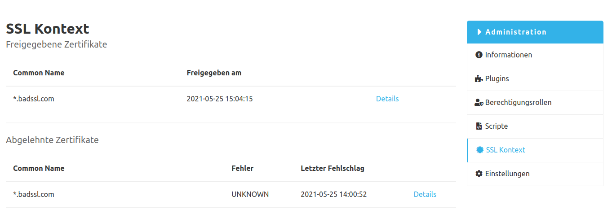
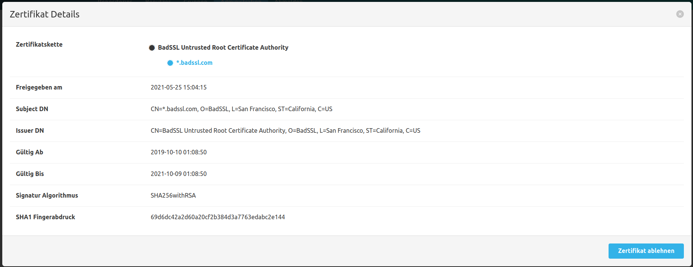
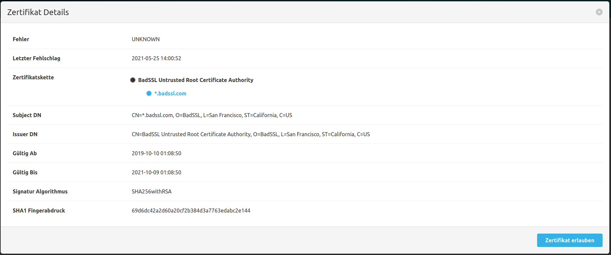
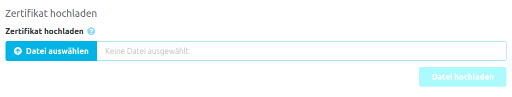

Im Admin Bereich unter dem Menüpunkt `SSL Kontext` befindet sich die Übersicht der Zertifikate. 

### Freigegebene Zertifikate
In der oberen Tabelle befinden sich alle freigegebenen Zertifikate. Dabei handelt sich im Zertifikate, 
die explizit über den SCM-Manager als gültig markiert wurden, die vorher automatisch ablehnt wurden. Daher sollte beachtet werden,
dass dies keine vollständige Liste aller erlaubten Zertifikate ist. 
Gültige Zertifikate des Betriebssystems oder anderweitige gültige Zertifikate sind nicht enthalten. 

In der Detailansicht kann neben den weiteren Daten auch die Freigabe für ein Zertifikat wieder entzogen werden. 

### Abgelehnte Zertifikate
In der zweiten Tabelle finden sich alle Zertifikate, die vom Server abgelehnt wurden. 
Dabei kann es sehr unterschiedliche Gründe für die Ablehnung geben. Wurde ein Zertifikat fälschlicherweise abgelehnt, kann eine Freigabe erteilt werden. 
Dies geht jedoch nur für Zertifikate, die für den Server unbekannt sind. 
Weitere Ablehnungsgründe wie zum Beispiel `abgelaufen` oder `zurückgezogen` machen ein Zertifikat tatsächlich ungültig und können daher nicht freigegeben werden. 
In der Detailansicht eines Zertifikats können neben dem Server Zertifikat auch Zertifikate aus der Zertifikatskette geprüft und freigegeben werden.

### Zertifikate hochladen
Über die Dateiauswahl können X509 Zertifikate manuell hochgeladen und damit freigegeben werden. 
Hochgeladene Zertifikate werden beim Hochladen nicht auf ihre Gültigkeit überprüft. 
Es können nur X509 Zertifikats-Dateien unter 50 KB hochgeladen werden.

