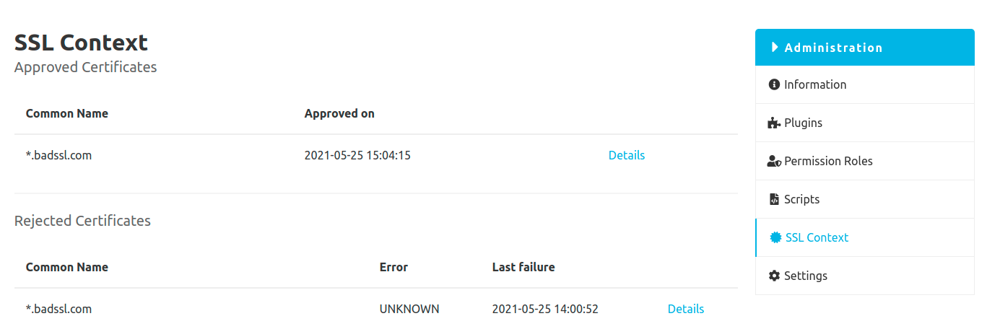
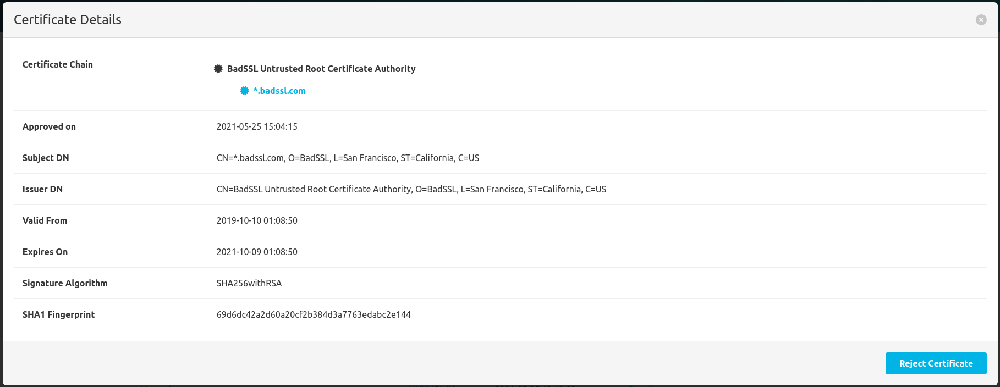
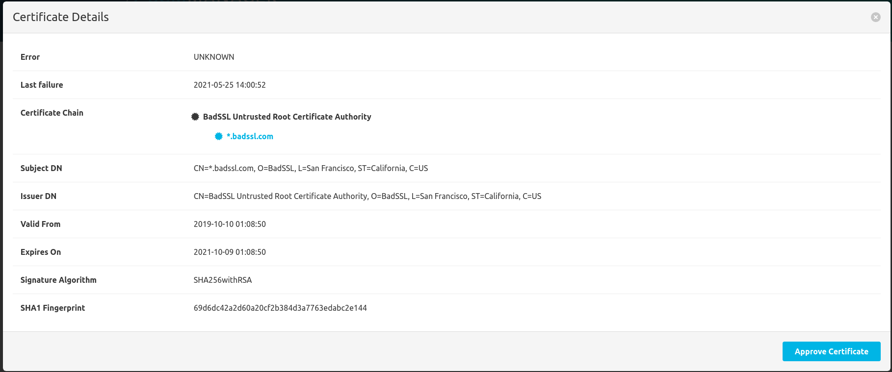

In the admin area under the menu item `SSL Context` you can find the certificate overview.

### Approved certificates
The upper table contains all approved certificates. These are certificates
that have been explicitly marked as valid via the SCM Manager, which were previously automatically rejected. 
Therefore it should be noted that this is not a complete list of all allowed certificates.
Valid certificates of the operating system or other valid certificates are not included.

In addition to the other data, the approval for a certificate can also be revoked in the detail view.

### Rejected certificates
The second table contains all certificates that have been rejected by the server.
There can be very different reasons for the rejection. If a certificate was rejected by mistake, it has to be approved.
However, this only works for certificates that are unknown to the server.
Other reasons for rejection, such as `expired` or `revoked`, actually make a certificate invalid and therefore cannot be approved.
In the detail view of a certificate, the entire certificate chain can be checked and approved in addition to the actual certificate.

